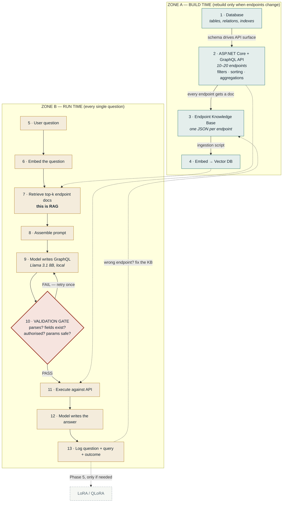

# ERP GPT

Ask the ERP a question in plain language. Get an answer from live data.

```
"Top 5 customers by revenue this year"
        │
        ▼
  [retrieve endpoint docs] → [LLM writes GraphQL] → [validate] → [execute] → answer
```

**The one rule that keeps this system safe:** the AI layer never touches the database.
It only ever picks a GraphQL endpoint and fills in its parameters. Only the API knows
about data.

---

## System flow



Full architecture notes: [`docs/architecture.md`](docs/architecture.md)

---

## Chat UI

The real app: [`web/`](web/) — Angular 21 + Bootstrap 5. Answers are mocked
behind a one-line-swappable seam until the Phase 4 agent exists.

```bash
cd web && npm install && npm start     # http://localhost:4200
```

The static mockup in [`demo/`](demo/) is what `web/` was built from, and stays
as the public link until `web/` is deployed:

- Live page (GitHub Pages): https://hammadrehmanawan.github.io/erp-gpt/
- Instant preview: [open HTML preview](https://htmlpreview.github.io/?https://github.com/HammadRehmanAwan/erp-gpt/blob/feature/demo_html/demo/index.html)

`demo/execution-flow.html` has no replacement in `web/` and must be carried
across at cutover — see [`web/doc/web-plan.md`](web/doc/web-plan.md).

---

## Repo layout & ownership

| Folder | What lives here | Owner |
|---|---|---|
| `api/` | ASP.NET Core + HotChocolate GraphQL API | Hammad, Usama, Nazim |
| `db/` | Migrations, seed data, naming convention | Hammad, Usama, Nazim |
| `kb/` | One JSON doc per endpoint — see `kb/_schema.json` | Zahid, Kashif |
| `embeddings/` | Ingestion script: KB → vector DB | Zahid, Kashif |
| `eval/` | 50 test questions + scoring script | Hammad |
| `agent/` | Retrieval, prompt assembly, validation gate | Phase 4 |
| `web/` | Angular 21 + Bootstrap 5 chat UI — answers mocked until `agent/` exists | **unassigned** |
| `training/` | Empty on purpose — see its README | Phase 5, gated |

---

## Phases

| Phase | Scope | Done when |
|---|---|---|
| 1 | DB + API (steps 1–2) | Postman collection is green |
| 2 | Endpoint KB + embeddings (steps 3–4) | Every endpoint has a KB file; eval set written |
| 3 | Retrieval only (steps 6–7) | Hit-rate measured on the 50 questions |
| 4 | Full loop (steps 8–13) | End-to-end accuracy measured on the same 50 |
| 5 | LoRA/QLoRA — **only if needed** | Gated on Phase 4 logs showing a format-error pattern |

**Why Phase 5 is last:** LoRA training data is real user questions paired with correct
GraphQL. We don't have any until Phase 4 is logging them. Facts live in RAG; format
lives in LoRA; data lives only behind the API.

---

## Getting started

```bash
# Database (Docker) — see SETUP.md for the one-time dataset load
cd api && docker compose up -d

# API — http://localhost:5000/graphql
dotnet run --project api/ErpGpt.GraphQLApi

# Chat UI — http://localhost:4200
cd web && npm install && npm start

# KB ingestion (once embeddings/ is built)
cd embeddings && python ingest.py

# Retrieval eval (once the vector DB is populated)
cd eval && python score_retrieval.py
```

`api/ErpGpt.Api` is an earlier prototype that seeds synthetic data into the
same database — run `ErpGpt.GraphQLApi`, not that one.

## Contributing rules

1. **Change an endpoint → update its KB file in the same PR.** CI enforces this.
2. Aggregations live in C#, never composed by the model.
3. Every endpoint declares auth and a `limit` ceiling from day one.
4. Nothing in `kb/` may contain business data — endpoint documentation only.
5. `web/` never composes a query. It asks a `ChatService` and renders the
   structured blocks it gets back — no GraphQL in the browser, no raw HTML.
